# Анализ производительности страницы с помощью Chrome DevTools

**URL для анализа:** [https://kmept.ru/college/article/web-dizayner-osobennosti-professii-kak-postupit-i-kakie-ekzameny-sdavat/](https://kmept.ru/college/article/web-dizayner-osobennosti-professii-kak-postupit-i-kakie-ekzameny-sdavat/)

---

## 1. Дублирование ресурсов

Найдены несколько ресурсов, которые загружаются более одного раза.

**Почему это плохо:**

- Увеличивается объем передаваемых данных — трафик растет без необходимости.
- Замедляется загрузка страницы, так как браузер выполняет лишние запросы.
- Увеличивается время ожидания для пользователя, страница кажется медленнее.
- Увеличивается нагрузка на сервер.

**Пример:**

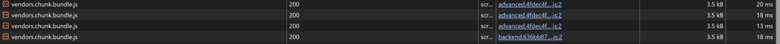 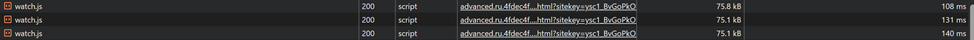 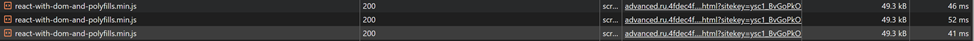 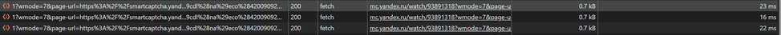 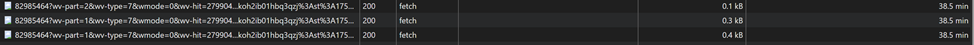 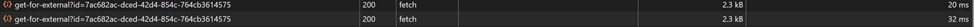 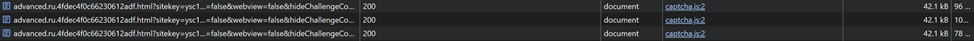

Одно и то же изображение загружается 3 раза под разными названиями:

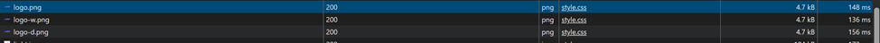

---

## 2. Лишний размер ресурса

Большие размеры изображений, которые можно минифицировать для более быстрой загрузки.

**Почему это плохо:**

- Большой объем данных замедляет загрузку, особенно на медленных соединениях.
- Увеличивается время рендеринга.

**Пример:**

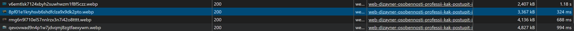

---

## 3. Медленно загружающиеся ресурсы

Некоторые ресурсы загружаются заметно дольше остальных.

**Почему это плохо:**

- Замедляется отображение содержимого страницы, пользователь видит пустую или частично загруженную страницу.
- Ухудшается восприятие скорости сайта.

**Пример:**

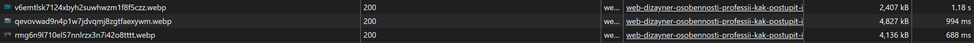

---

## 4. Дополнительно

- Найдены два запроса со статусом **Canceled**:
  - Неправильная логика загрузки ресурса (например, скрипт запрашивается, но сразу отменяется).
  - Избыточные запросы, которые никогда не используются.
  - Потенциальное ухудшение производительности, если таких запросов много.

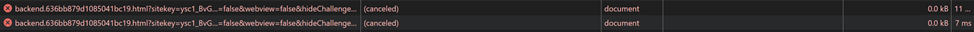

- **Заблокированные запросы из-за COEP**
  - metrika_match.html
  - Запросы к ресурсу были заблокированы политикой безопасности Cross-Origin Embedder Policy (COEP). Такие ошибки могут приводить к некорректной работе аналитики или сторонних скриптов, если эти файлы необходимы для функционала.

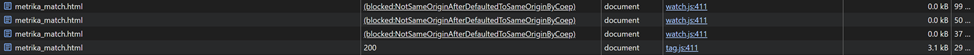

---

## 5. Метрики производительности (Performance)

**Время в миллисекундах от начала навигации до событий:**

- **First Contentful Paint (FCP):** 245.8 мс 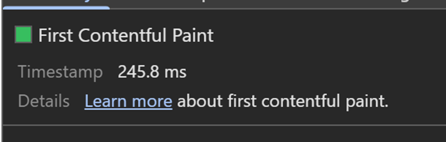
- **Largest Contentful Paint (LCP):** 245.8 мс 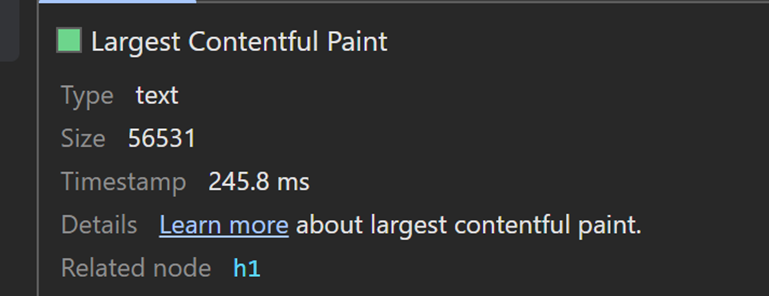
- **DOM Content Loaded (DCL):** 343.6 мс 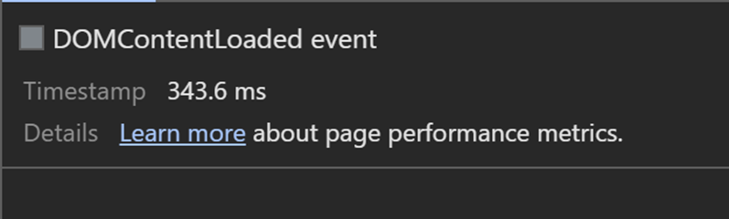
- **Load:** 2 564.1 мс 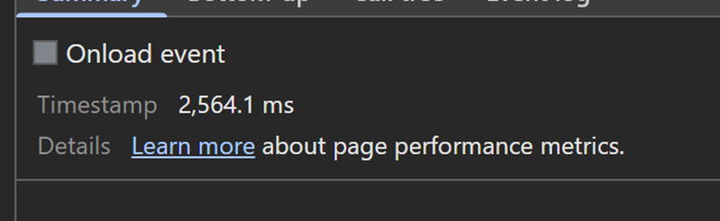

На скриншоте ниже можно увидеть FCP, LCP, DCL на таймлайне:

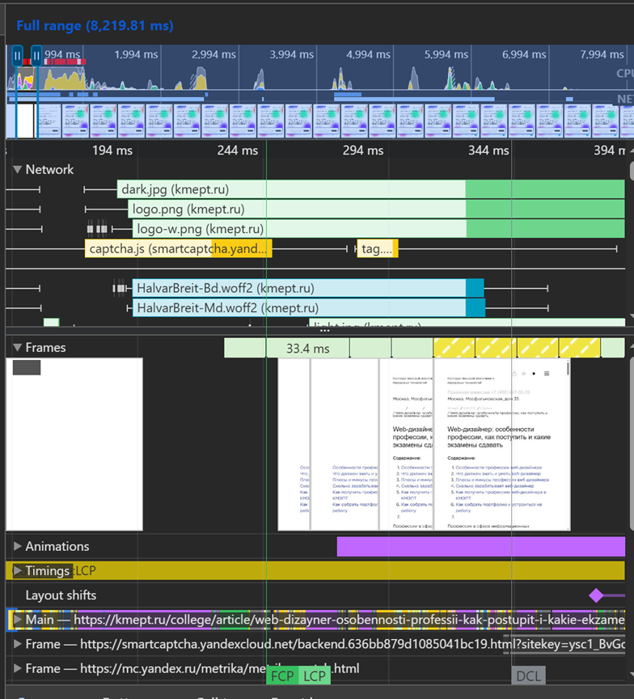

- **LCP происходит на DOM-элементе:** `<h1>`

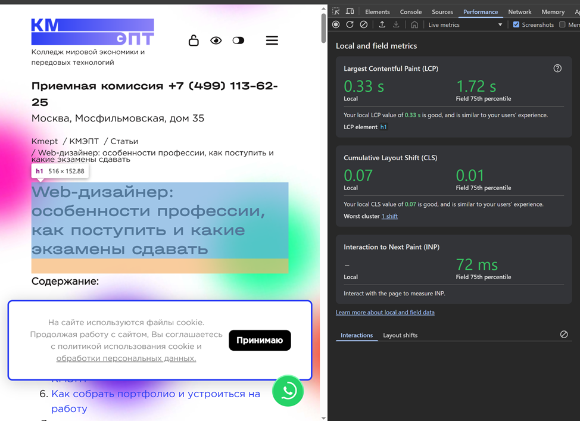

**Время, затраченное на этапы обработки документа:**

- **Loading:** 25 мс
- **Scripting:** 691 мс
- **Rendering:** 386 мс
- **Painting:** 136 мс

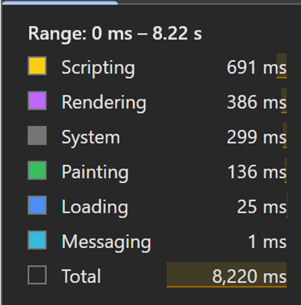

---

## 6. Покрытие (Coverage)

- **Скриншот вкладки после загрузки страницы:**

  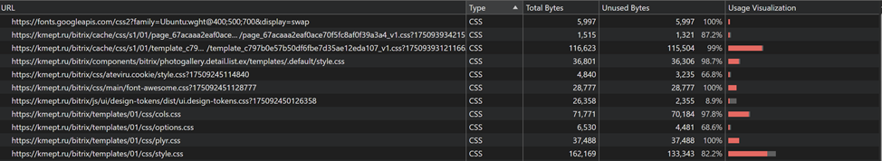

- **Неиспользованный CSS:** 428.7 килобайт

  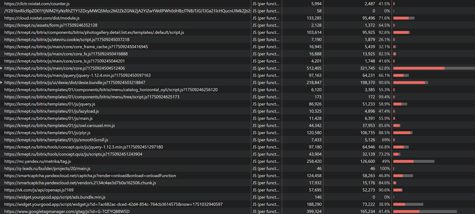

- **Неиспользованный JS:** 1,311.37 килобайт

  

---

## Выводы и рекомендации

### Дублирование ресурсов

- Исправить загрузку повторяющихся ресурсов, чтобы избежать лишних загрузок.
- Провести ревизию ассетов и удалить дубликаты.

### Медленно загружающиеся ресурсы

- Проверить, не блокируют ли эти ресурсы критический рендеринг.
- Использовать CDN для ускорения загрузки статических файлов.
- Оптимизировать и минифицировать JS и CSS.
- Перенести не критичные для первого экрана скрипты в конец страницы или подключать с атрибутом defer/async.

### Блокирующие и отменённые запросы

- Проверить, нужны ли отменённые запросы — возможно, их можно убрать из кода.
- Настроить корректные заголовки CORS/COEP для сторонних скриптов, если они необходимы.
- Удалить неиспользуемые или устаревшие скрипты.

### Метрики производительности

- FCP и LCP происходят быстро (245.8 мс), но можно ускорить за счет оптимизации критического CSS и уменьшения количества блокирующих ресурсов.
- Scripting занимает 691 мс — стоит удалить, тыжелые или неиспользуемые JS.
- Load (2 564.1 мс) можно ускорить за счет оптимизации скриптов и уменьшения неиспользуемого кода.

### Покрытие (Coverage)

- Разделить CSS и JS на модули, загружать только необходимые для текущей страницы.

---

**В результате анализа страницы были выявлены основные узкие места:** дублирование ресурсов, избыточный размер изображений, медленно загружающиеся и неиспользуемые ресурсы. Внедрение предложенных мер позволит ускорить загрузку страницы, снизить нагрузку на сервер и улучшить пользовательский опыт.
